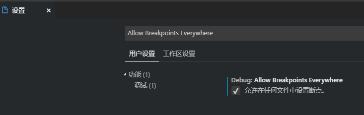
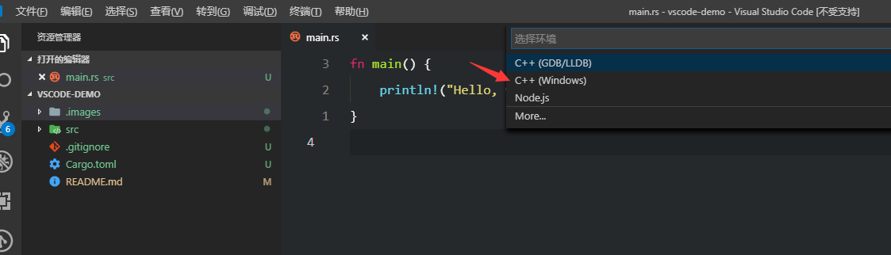
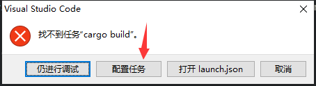
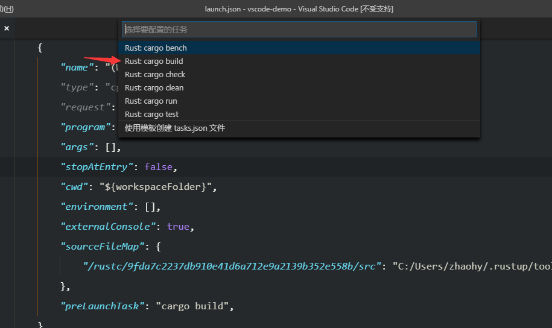
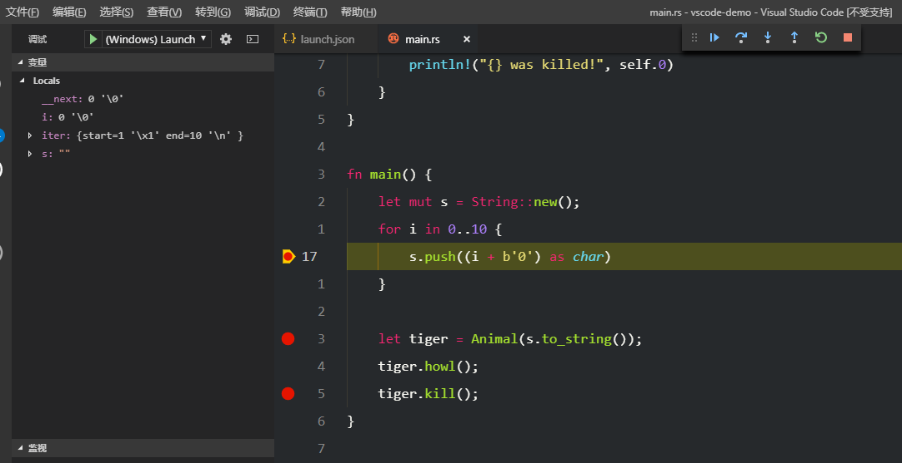
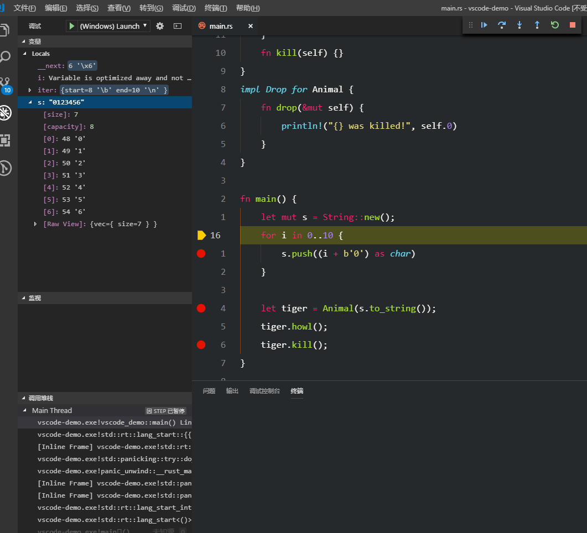
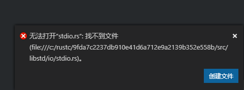
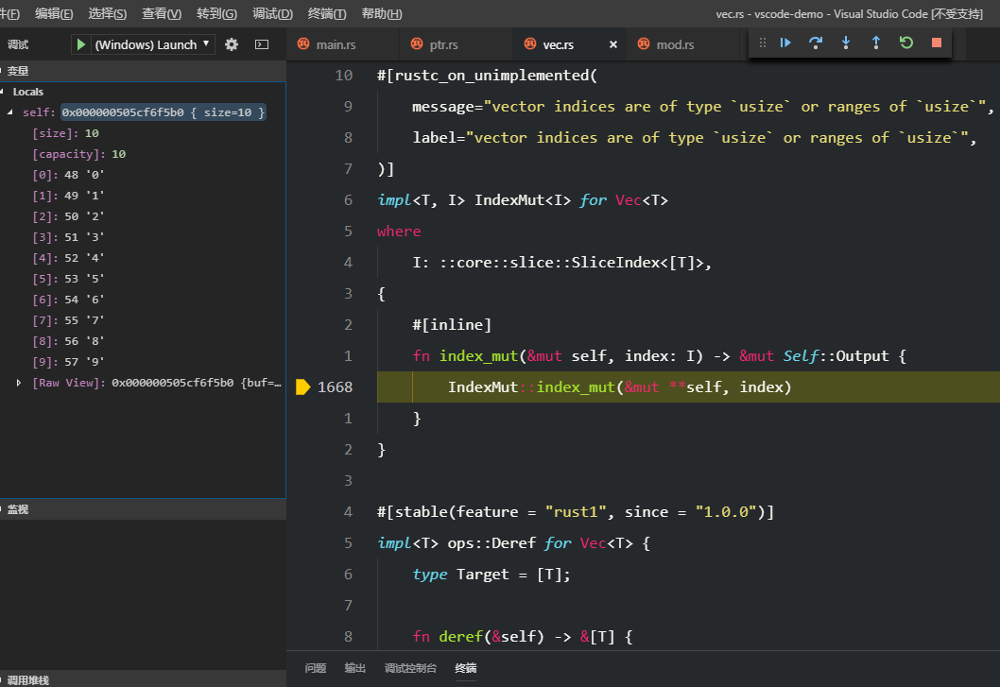

# 如何在 Visual Studio Code 中 Debug Rust 程序


## 前言

在 Windows 上安装 Rust 默认配置使用 MSVC 工具链，官方建议大部分情况使用默认就可以了，可是最好用的 Rust IDE 调试不支持 MSVC 工具链。如果你想享受到完整的编码体验，可以切换到 GNU 工具链

```bash
$ rustup install stable-gnu
$ rustup default stable-gnu
```


如果就想用默认工具链怎么办，闲得没事折腾半天找到了比较好的办法，参考网上教程，但还是有坑（其实我很少用 vscode，等别人完善吧哈哈

群里有人让分享一下，想想还是写篇详细的教程，一劳永逸。


## 环境

- 测试环境
  ```bash
  Default host: x86_64-pc-windows-msvc
  
  installed toolchains
  --------------------
  
  stable-x86_64-pc-windows-gnu
  stable-x86_64-pc-windows-msvc (default)
  
  active toolchain
  ----------------
  
  stable-x86_64-pc-windows-msvc (default)
  rustc 1.32.0 (9fda7c223 2019-01-16)
  ```

- 需要的扩展

  [C/C++ ](https://marketplace.visualstudio.com/items?itemName=ms-vscode.cpptools) 

  [Rust (rls)](https://marketplace.visualstudio.com/items?itemName=rust-lang.rust) 不是必须的，用它提供的 task 省事

- 设置 vscode

  C/C++ 扩展默认是不允许在 Rust 代码上放断点的，安装好扩展之后，打开设置搜索 `allowBreakpointsEverywhere`，根据自己需求修改**全局**或者**工作区**的配置
  `"debug.allowBreakpointsEverywhere": true`

  

  或者，到文末的 github 仓库，拷贝 `.vscode` 文件夹到你自己的工作区中（这可能会覆盖你的设置）

  

## 配置

**注意：新手请确保 vscode 打开了一个新的 Rust 工程，保持条件一致**

如果你之前没有创建过调试配置，按 `F5` 会让你创建新的配置，选择 `C++(Windows)`

或者从菜单栏 `调试 ->添加配置`进入




如果正常的话，vscode 会帮你创建一个新的文件 `.vscode\launch.json`，请参考我的模版，需要改的很少，主要就3个

- program，需要调试的程序路径，可以写绝对路径，我的设置比较通用

- sourceFileMap，如果没有正确设置，调试时跳转到标准库时会报错“文件不存在”

  **因为暂时不能确定替换的值，所以先注释掉**，

  - 源路径，如果你的 rust 环境和我一样，那么可以直接使用  */rustc/9fda7c2237db910e41d6a712e9a2139b352e558b/src* ， 否则需要根据报错信息来修改，在后面会说如何修改。可能最烦的是每次更新需要重新设置
  - 映射路径，是你所用的工具链标准库源码路径，一般 `.rustup`文件夹在你个人文件夹下面

- preLaunchTask，在开始调试前需要运行的任务，我们设置自动运行 `cargo build`，省得手动执行

```json
{
    // 使用 IntelliSense 了解相关属性。 
    // 悬停以查看现有属性的描述。
    // 欲了解更多信息，请访问: https://go.microsoft.com/fwlink/?linkid=830387
    "version": "0.2.0",
    "configurations": [
        {
            "name": "(Windows) Launch",
            "type": "cppvsdbg",
            "request": "launch",
            "program": "${workspaceFolder}/target/debug/${workspaceFolderBasename}",
            "args": [],
            "stopAtEntry": false,
            "cwd": "${workspaceFolder}",
            "environment": [],
            "externalConsole": false,
            "sourceFileMap": {
                //"/rustc/{更新就要改}/src": "{写你的 .rustup 上级路径}/.rustup/toolchains/stable-x86_64-pc-windows-gnu/lib/rustlib/src/rust/src",
            },
            "preLaunchTask": "cargo build",
        }
    ]
}
```


到了这里大部分工作已经完成，再次按 `F5`启动调试，我们会看到一个错误信息，点击 **配置任务**，然后选择 `cargo build`






自动创建一个 task 文件，暂时不需要修改。

```json
{
    // See https://go.microsoft.com/fwlink/?LinkId=733558
    // for the documentation about the tasks.json format
    "version": "2.0.0",
    "tasks": [
        {
            "type": "cargo",
            "label": "cargo build",
            "command": "cargo",
            "args": [
                "build"
            ],
            "problemMatcher": [
                "$rustc"
            ]
        }
    ]
}
```


## 调试

这个例子只是作为演示，嫌麻烦直接复制过去使用

```rust
fn main() {
    let mut s = String::new();
    for i in 0..10 {
        s.push((i + b'0') as char)
    }
}
```

设置断点，然后 `F5`开启调试




点击上方调试工具栏的按钮，可以看到左侧可视化数据的改变，连复合数据类型中指针指向的数据也可以显示




如果你跳转到标准库源码，会看到一个“文件不存在”的报错，这就是我们需要补充的信息！复制中间一串 hash 一样的数字到我们上面注释掉的地方 `sourceFileMap`，然后删掉注释



重新开始调试！如果正确的话，应该可以跳转到标准库源码了




## 其他
建议新手直接拉取仓库，用 demo 先试试
[demo 仓库](https://github.com/yim7/vscode-demo)


## 已知问题

- sourceFileMap 设置后还是有问题，比如 stdio.rs 依然报错不存在

